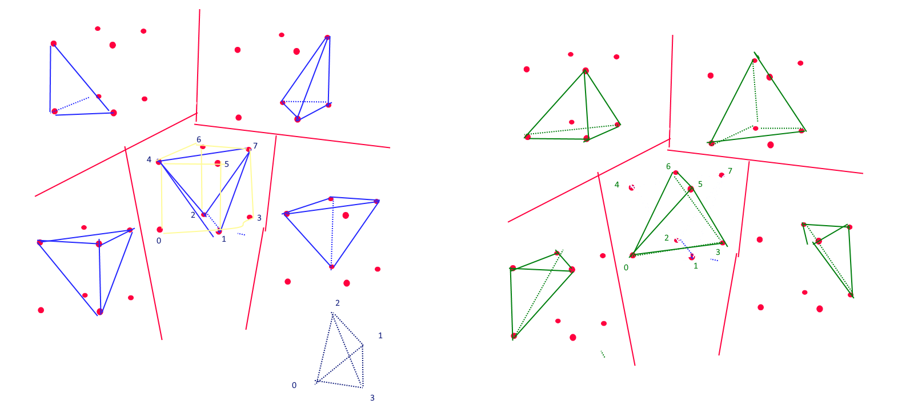
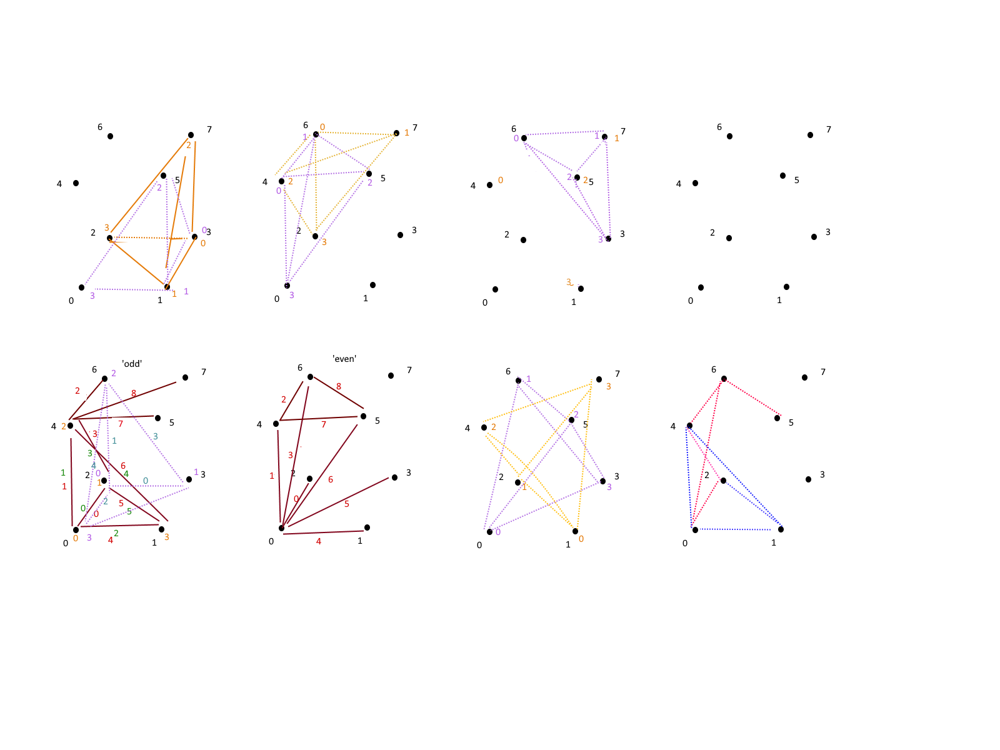

## Marching Diamond Crystal Lattice

### Marching Cubes - sliced with 5 tetrahedrons.

### Marching Tetrahdrons

# Marching Diamond Crystal Lattice Detail

See also

Testing framework : http://mikolalysenko.github.io/Isosurface/

https://github.com/mikolalysenko/isosurface.git

Prior Testing framework: https://d3x0r.github.io/MarchingTetrahedra/
(this) Testing framework: https://github.com/d3x0r/IsoSurface-MultiTexture

see also https://en.wikipedia.org/wiki/Marching_tetrahedra

This adds texturing to the flat isosurface mesh calculation.  It demonstrates a method of 3d volume repeating textures.  (Texture generator is included in src/).
Adds several options for scaling/stylizing data.

`Marching Tetrahedra 3 (DLC-Volume)` mode slices a cloud one cloud at a time; removes 3 calucations per spot; increasing size of working data; improves potential merged points in maximized/minimized conditions.

`Marching Tetrahedra 3 (DLC-Plane)` mode slices a cloud a plane at a time, generating a single calculation for all shared points.  Duduces the point count.

There is a version 'marchintTetrahedra2.js' which is the simplest, naive implementation that works on a single group of 8 points computing the inner mesh; although longer, this appears simpler than the plane or volume meshing versions, although does significantly more work.

This yields really good results for opening spaces, does not suffer from any discontinuities.

This meshing implementation assumes that 0 and below is 'outside' and anything > 0 has density.

in the case of distance to surface as point cloud data, the density is -distance; but then the option to use zero as inside surface must also be selected.

All triangles are trivially aligned with their proper normals.  The accompanying source code is complete.

The tetrahedral computation (tetCompute) in this code assumes the following.

The triangle mesher, given any input point, the point is either inside, or outside.  
  - (If 0 is 'inside') If it is inside, the face generation is inverted, and all values inverted.  In the case of 0 the state does not change from 'outside' to 'inside' so the origin point, which is ALWAYS outside, and is the source of computing the delta from 0 to points 1,2, or 3, then those points could also be 0, resulting in a slope that has no delta; this is forced to 0 as a result, so a 0 'inside' point is as close to itself as it can be.
  - (If 0 is 'outside') then, since the first point must be outside, if it is 0, then no inversion takes place.  If it isn't 0, then the delta computation for the slope will never be 0.

The conditions and plane generation can also all be reversed, such that 0 is 'inside' is proper, and the mesher expects the first inpoint point to be inside... which reverse all of the subtractions and >= to < comparisons.

Inspired from cells of diamond crystal lattice...

Instead of blank cells, I have alternating same-cells (the inside
tetrahdron is rotated 90 degrees each time, so the edge deltas are computed
along the same diagonal in mating cells.

My original idea was actually more of a marching - cuboctohedron
https://en.wikipedia.org/wiki/Cuboctahedron
which is formed from trying to densly stack equilateral tetrahedrons... and
then scalling a large stack down, in the middle you end up with 90 degree
cuts...

The cell is actually simpler than that; being a marching-cube, but with the
middle plane of it skewed  0.5 to the right and 'forward'/'up'?  where the
values of the skewed plane are an average of the 8 points around it.  This
ended up being 14 tetrahedrons, with 4 pyramidal penta-hedrons sliced into
2 tetrahedron each... But slicing the pyramids caused a lot of confusion in
mapping inverted/notinverted to the tetrahedra face emission.

the final result was only 5 tetrahedra, and no fabricated points.  (the
above also required a 3x3x2 matrix of values, so the 0.5 skew to the right
1 cell could be calculated)  This only requires the 5 points of the cell
much like yours.

I was iterating through the tet vertices to find one that was 'outside' and
then just always build from an outside point; but depending on ordering of
the vertices that can be tricky; I ordered mine so every other point is
inverted, and a mod4 can be applied to wrap the point indexing, reducing it
to just 1 if case , and its sub-cases...

## Inflation

